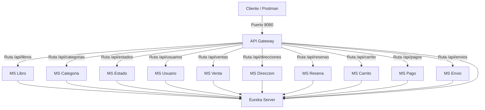

# Proyecto Librería Online - Arquitectura de Microservicios

Este repositorio contiene la solución completa para la plataforma de la **Librería Online**, implementada con una arquitectura de microservicios usando **Spring Boot**, **Spring Cloud** y **MySQL**.

---

## 1. Arquitectura del Sistema

El ecosistema está compuesto por un servidor de descubrimiento, un portal de enrutamiento centralizado y 10 microservicios de negocio independientes que se comunican entre sí utilizando **Spring Cloud OpenFeign**:



---

## 2. Mapa de Puertos y Servicios

Todos los servicios se auto-registran dinámicamente en Eureka Server. Los puertos preconfigurados son los siguientes:

| Servicio | Nombre en Eureka (`spring.application.name`) | Puerto | Descripción |
|---|---|---|---|
| **Eureka Server** | `eureka-server` | `8761` | Servidor de registro y descubrimiento. |
| **API Gateway** | `api-gateway` | `8080` | Punto de entrada y enrutador central de peticiones. |
| **MS Usuario** | `ms-usuario` | `8082` | Gestión de usuarios, roles y credenciales. |
| **MS Libro** | `ms-libro` | `8081` | Gestión de catálogo de libros y fotos asociadas. |
| **MS Categoria** | `ms-categoria` | `8083` | Gestión de categorías literarias. |
| **MS Estado** | `ms-estado` | `8084` | Estados del sistema (ventas, arriendos, despachos). |
| **MS Reseña** | `ms-resena` | `8087` | Valoraciones y comentarios de libros por usuario. |
| **MS Dirección** | `ms-direccion` | `8088` | Gestión de regiones, comunas y domicilios de entrega. |
| **MS Carrito** | `ms-carrito` | `8085` | Gestión temporal de items de compra agregados por el usuario. |
| **MS Venta** | `ms-venta` | `8086` | Procesamiento de órdenes de venta, checkout y detalles. |
| **MS Pago** | `ms-pago` | `8089` | Registro y validación de transacciones financieras. |
| **MS Envío** | `ms-envio` | `8090` | Logística y seguimiento de despachos físicos. |

---

## 3. Características Principales de la Implementación

- **Estandarización de Capas (CSR)**: Todos los servicios de negocio usan el patrón **Interfaz + Implementación** para desacoplar el contrato de la lógica concreta.
- **Uso estricto de DTOs**: La capa de controladores públicos interactúa únicamente a través de `RequestDTO` (entradas validadas con `@Valid`) y `ResponseDTO` (salidas estructuradas).
- **Manejo Centralizado de Excepciones**: Cada microservicio cuenta con un `GlobalExceptionHandler` mapeando errores semánticos a respuestas HTTP apropiadas:
  - `404 Not Found` para `RecursoNoEncontradoException` (ej. libro, usuario o venta no existente).
  - `503 Service Unavailable` para `ServicioExternoNoDisponibleException` (ej. caída de un servicio dependiente vía Feign).
  - `400 Bad Request` para validaciones (`MethodArgumentNotValidException`) y lógica de negocio inválida (`IllegalArgumentException`).
- **Orquestación del Flujo de Compra**:
  1. El usuario agrega libros a su carrito (`ms-carrito`).
  2. Al llamar a `POST /api/ventas/checkout/{idUsuario}` (`ms-venta`), se crea la Venta, se generan sus Detalles y se vacía el Carrito.
  3. El usuario realiza el pago mediante `POST /api/pagos` (`ms-pago`). Esto valida que el monto coincida y cambia automáticamente el estado de la venta en `ms-venta` a `PAGADA` (ID `3L`).
  4. La orden de despacho física se registra en `POST /api/envios` (`ms-envio`), el cual valida de antemano que la venta esté en estado `PAGADA` para proceder.
- **Documentación Interactiva (Swagger/OpenAPI)**: Cada microservicio expone sus especificaciones bajo `springdoc.api-docs.path`. Toda la suite de documentación está unificada e interactiva en la UI central del Gateway: `http://localhost:8080/webjars/swagger-ui/index.html`.

---

## 4. Requisitos Previos

- **Java JDK 21** o superior.
- **Maven 3.8+** (o usar el Maven Wrapper `./mvnw` incluido).
- **MySQL 8.0** levantado de forma local (los microservicios apuntan por defecto a `jdbc:mysql://localhost:3306/` con usuario `root` y clave vacía).

---

## 5. Instrucciones de Despliegue

### Paso 1: Configurar Base de Datos
Ejecutar el script SQL incluido en la raíz del proyecto para crear las bases de datos requeridas para cada microservicio:
```bash
mysql -u root -p < crear_bases_biblioteca_online.sql
```

### Paso 2: Compilar el Proyecto Completo
Desde el directorio `Biblioteca Online` en la raíz del repositorio, ejecuta la compilación y ejecución de tests unificados:
```bash
cd "Biblioteca Online"
./mvnw clean test
```

### Paso 3: Levantar los Servicios en Orden
Es fundamental iniciar los servicios de infraestructura primero para garantizar la correcta resolución de dependencias:
1. **Eureka Server**: levantar `./mvnw spring-boot:run` dentro del módulo `eureka-server`.
2. **API Gateway**: levantar `./mvnw spring-boot:run` dentro del módulo `api_gateway`.
3. **Microservicios de negocio**: iniciar los demás microservicios en cualquier orden de preferencia.

---

## 6. Documentación de Endpoints Principales

Puedes interactuar con los servicios enviando peticiones HTTP directas a través del API Gateway (`http://localhost:8080/api/...`):

- **Agregar item al Carrito**:
  `POST http://localhost:8080/api/carrito`
- **Checkout de Carrito**:
  `POST http://localhost:8080/api/ventas/checkout/{idUsuario}`
- **Registrar Pago**:
  `POST http://localhost:8080/api/pagos`
- **Despachar Envío (solo ventas pagadas)**:
  `POST http://localhost:8080/api/envios`
- **Swagger UI Centralizado**:
  `http://localhost:8080/webjars/swagger-ui/index.html`
